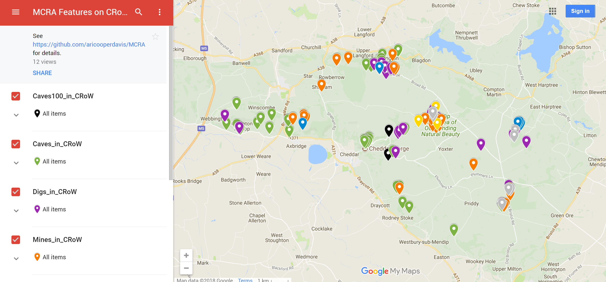

# MCRA_CRoW_Features
.kml files listing features from the MCRA database that exist on CRoW land. CRoW Shapefiles used to construct these .kmls were taken from https://naturalengland-defra.opendata.arcgis.com/datasets/crow-act-2000-access-layer, whilst the original MCRA .kmls used were taken from http://www.mcra.org.uk/registry/registrysearch.php. To comply with the MCRA's license I declare that some modifications were made of the data, for example the deletion of cave descriptions.

The naming of the files is the MCRA convention - as such the most interesting file for most people will be Caves100_in_CRoW.kml, which lists the caves on CRoW land who's length is greater than 100m. 

## View on Google Maps
I have uploaded these files to Google Maps for ease of access: https://drive.google.com/open?id=11FW4L15Mz4w5lEH2d-dZz00NwKzXok6d&usp=sharing

